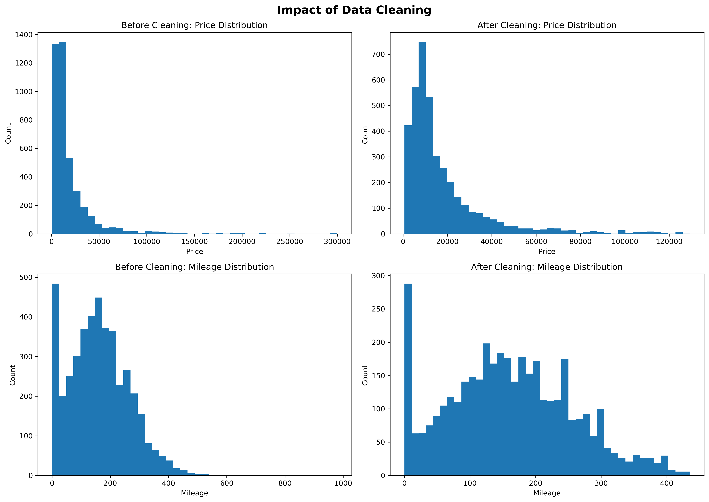

# Used Car Data Cleaning Pipeline

## Overview

Real-world datasets are rarely ready for analysis. Missing values, inconsistent formatting, and extreme outliers can significantly reduce the quality of statistical models and machine learning algorithms.

This project demonstrates a complete data cleaning workflow using a used vehicle sales dataset. The accompanying Jupyter Notebook documents each preprocessing step, from loading and inspecting the raw data to cleaning, visualization, and exporting a model-ready dataset.

---

## Business Problem

Predictive models are only as reliable as the data used to train them.

Before building regression models, analysts must identify and correct common data quality issues, including:

- Missing values
- Inconsistent column names
- Invalid observations
- Extreme outliers
- Data formatting inconsistencies

This project demonstrates a repeatable preprocessing pipeline that prepares automotive sales data for future predictive modeling.

---

## Technologies Used

- Python
- Pandas
- Matplotlib
- Jupyter Notebook

---

## Installation

### Option 1: Download the Repository

1. Click **Code** → **Download ZIP** on GitHub.
2. Extract the ZIP file.
3. Open the project folder.

### Option 2: Clone the Repository

```bash
git clone https://github.com/yourusername/Used-Car-Data-Cleaning-Pipeline.git
```

### Install the Required Packages

```bash
pip install -r requirements.txt
```

### Run the Jupyter Notebook

Launch Jupyter Notebook:

```bash
jupyter notebook
```

Open **Used Car Data Cleaning Pipeline.ipynb** and select **Run → Run All Cells**.

The notebook is self-contained and loads the dataset directly from the project folder. No code modifications are required.

---

## Project Workflow

1. Load the raw vehicle sales dataset
2. Standardize column names
3. Explore the dataset structure
4. Inspect summary statistics
5. Identify missing values
6. Remove incomplete records
7. Filter unrealistic observations and outliers
8. Compare data distributions before and after cleaning
9. Export a cleaned dataset for future regression analysis

---

## Key Results

The completed cleaning pipeline successfully:

- Standardized dataset column names
- Removed records containing missing values
- Filtered unrealistic engine sizes
- Removed extreme price outliers
- Removed extreme mileage outliers
- Exported a cleaned dataset ready for predictive modeling

---

## Example Visualization

The notebook includes visual comparisons demonstrating the impact of the cleaning process on the dataset.



---

## Repository Structure

```text
Used-Car-Data-Cleaning-Pipeline/
│
├── Used Car Data Cleaning Pipeline.ipynb
├── CarDataCleaning.py
├── used_car_sales.csv
├── used_car_sales_cleaned.csv
├── README.md
├── requirements.txt
└── figures/
    └── before_after_distributions.png
```

---

## Jupyter Notebook

This repository also includes a Jupyter Notebook documenting the complete data cleaning workflow.

The notebook is designed to run from start to finish without modification after installing the required packages. Simply open **Used Car Data Cleaning Pipeline.ipynb** and select **Run → Run All Cells**.

The notebook demonstrates:

- Loading the raw dataset
- Exploring data quality
- Cleaning missing values
- Removing outliers
- Comparing distributions before and after cleaning
- Exporting a cleaned dataset

---

## Skills Demonstrated

- Data Cleaning
- Exploratory Data Analysis (EDA)
- Data Visualization
- Outlier Detection
- Data Preprocessing
- Python
- Pandas
- Matplotlib
- Jupyter Notebook

---

## Future Improvements

Potential enhancements include:

- Building linear regression models using the cleaned dataset
- Feature engineering
- Comparing multiple regression algorithms
- Evaluating model performance using RMSE, MAE, and R²
- Creating an interactive Tableau or Power BI dashboard from the cleaned data

---

## Author

**Brian Sentz**

This project is part of my Data Analytics and Technical Project Management portfolio and demonstrates practical data preparation techniques commonly used in business intelligence and machine learning workflows.
