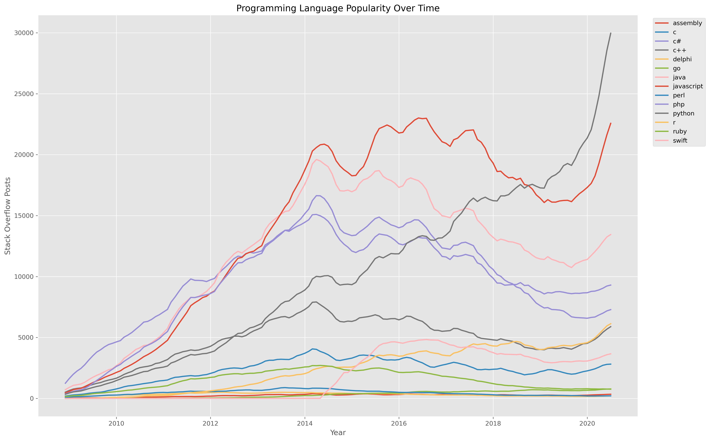

# Programming Language Trends

## Overview

This project analyzes historical programming language popularity using publicly available Stack Overflow data.

The accompanying Jupyter Notebook demonstrates how to reshape time-series data, handle missing values, smooth trends using rolling averages, and visualize long-term programming language popularity using Python and Pandas.

---

## Business Problem

Technology trends evolve over time, making it valuable to understand how programming languages gain or lose popularity.

This project demonstrates how historical data can be transformed into meaningful visualizations that reveal long-term adoption trends and support data-driven technology insights.

---

## Technologies Used

- Python
- Pandas
- Matplotlib
- Jupyter Notebook

---

## Installation

### Option 1: Download the Repository

1. Click **Code** → **Download ZIP** on GitHub.
2. Extract the ZIP file.
3. Open the project folder.

### Option 2: Clone the Repository

```bash
git clone https://github.com/yourusername/Programming-Language-Trends.git
```

### Install the Required Packages

```bash
pip install -r requirements.txt
```

### Run the Jupyter Notebook

Launch Jupyter Notebook:

```bash
jupyter notebook
```

Open **Programming Language Trends.ipynb** and select **Run → Run All Cells**.

The notebook is self-contained and loads the dataset directly from the project folder. No code modifications are required.

---

## Project Workflow

1. Load the programming language dataset
2. Explore the dataset structure
3. Reshape the data using a pivot table
4. Handle missing values
5. Calculate rolling averages
6. Visualize long-term programming language trends
7. Identify the most popular programming languages

---

## Key Results

The completed analysis demonstrates how to:

- Reshape time-series datasets
- Handle missing values
- Smooth noisy data using rolling averages
- Visualize long-term trends
- Compare programming language popularity over time

---

## Example Visualization

The notebook visualizes historical programming language popularity using a rolling six-month average.



---

## Repository Structure

```text
Programming-Language-Trends/
│
├── Programming Language Trends.ipynb
├── ProgrammingLanguageTrends.py
├── programming_language_trends.csv
├── README.md
├── requirements.txt
└── figures/
    └── programming_language_trends.png
```

---

## Jupyter Notebook

This repository also includes a Jupyter Notebook documenting the complete analytical workflow.

The notebook is designed to run from start to finish without modification after installing the required packages. Simply open **Programming Language Trends.ipynb** and select **Run → Run All Cells**.

The notebook demonstrates:

- Loading time-series data
- Reshaping datasets with pivot tables
- Handling missing values
- Applying rolling averages
- Visualizing historical programming language trends

---

## Skills Demonstrated

- Exploratory Data Analysis (EDA)
- Time Series Analysis
- Data Transformation
- Data Visualization
- Python
- Pandas
- Matplotlib
- Jupyter Notebook

---

## Future Improvements

Potential enhancements include:

- Interactive visualizations using Plotly
- Trend forecasting
- Language growth rate analysis
- Regional popularity comparisons
- Interactive dashboard using Tableau or Power BI

---

## Author

**Brian Sentz**

This project is part of my Data Analytics and Technical Project Management portfolio and demonstrates practical time-series analysis and data visualization techniques using Python.
