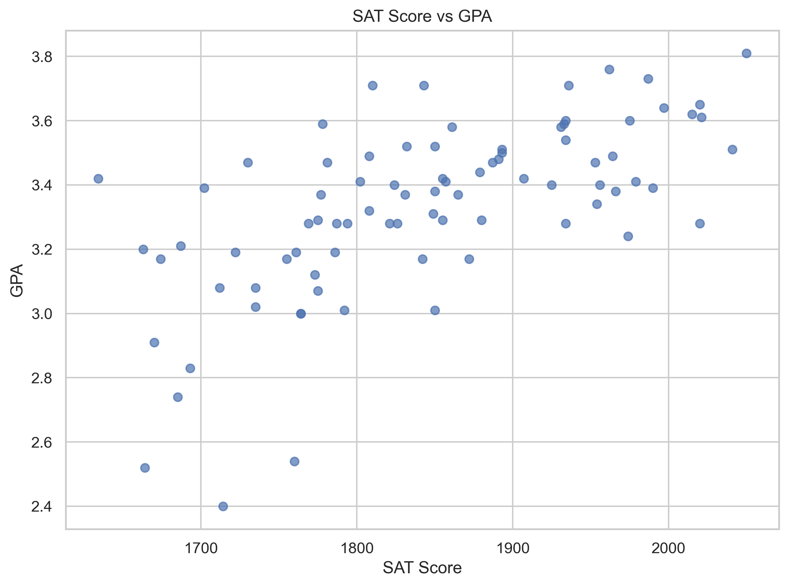
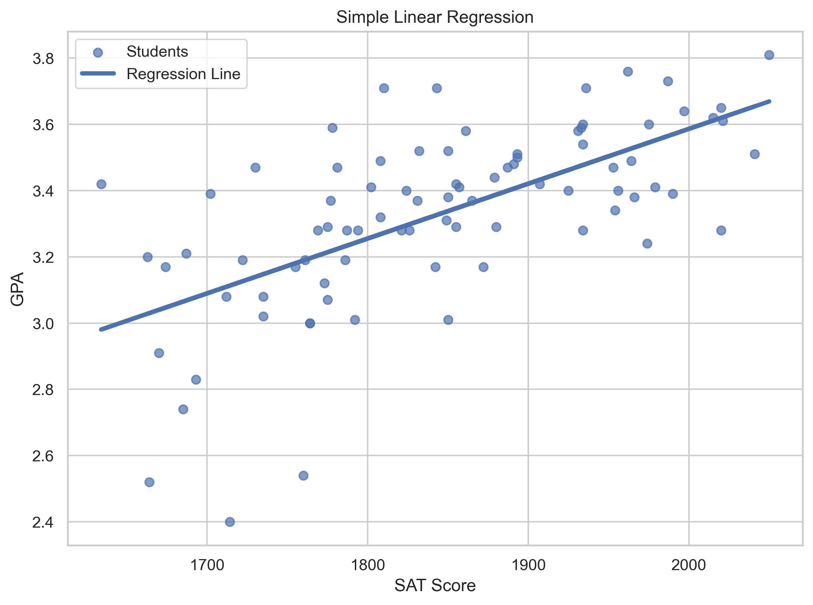

# SAT Score Linear Regression

## Overview

This project demonstrates how to build a simple linear regression model using **scikit-learn** to predict a student's Grade Point Average (GPA) from their SAT score.

The project walks through the complete machine learning workflow, including exploratory data analysis, model training, visualization, model evaluation, and prediction using a single independent variable.

---

## Business Problem

Educational institutions often seek to understand how standardized test scores relate to future academic performance.

This project explores the relationship between SAT scores and GPA using simple linear regression. While SAT scores alone cannot fully explain academic success, they provide a practical example of predictive analytics and supervised machine learning.

---

## Dataset

The dataset contains two variables:

| Variable | Description |
|----------|-------------|
| SAT | Student SAT score (independent variable) |
| GPA | Student Grade Point Average (dependent variable) |

---

## Technologies Used

- Python
- Pandas
- NumPy
- Matplotlib
- Seaborn
- Scikit-Learn
- Jupyter Notebook

---

## Getting Started

### Option 1: Download the Repository

1. Click **Code** → **Download ZIP** on GitHub.
2. Extract the ZIP file.
3. Open the project folder.

### Option 2: Clone the Repository

```bash
git clone https://github.com/yourusername/SAT-Score-Linear-Regression.git
cd SAT-Score-Linear-Regression
```

### Install Dependencies

Install the required Python packages:

```bash
pip install -r requirements.txt
```

### Run the Notebook

Launch Jupyter Notebook:

```bash
jupyter notebook
```

Open **SAT Score Linear Regression.ipynb** and select **Run → Run All Cells**.

The notebook is self-contained and loads the dataset directly from the project folder. No code modifications are required.

---

## Project Workflow

1. Load the student performance dataset
2. Explore the dataset
3. Visualize the relationship between SAT scores and GPA
4. Prepare the data for machine learning
5. Train a Simple Linear Regression model
6. Evaluate model performance
7. Visualize the regression line
8. Predict GPA for new SAT scores

---

## Key Results

This project demonstrates how to:

- Prepare data for machine learning
- Train a simple linear regression model
- Interpret regression coefficients
- Evaluate model performance using R²
- Generate predictions for new observations
- Visualize regression results

---

## Visualizations

### Relationship Between SAT Scores and GPA

The scatter plot below illustrates the positive relationship between SAT scores and student GPA.



---

### Linear Regression Model

The fitted regression line demonstrates how the model predicts GPA based on SAT score.



---

### Linear Regression Model

Regression line showing the fitted relationship between SAT scores and GPA.

*(Screenshot to be added.)*

---

## Repository Structure

```text
SAT-Score-Linear-Regression/
│
├── SAT Score Linear Regression.ipynb
├── SATScoreLinearRegression.py
├── student_gpa_data.csv
├── README.md
├── requirements.txt
└── figures/
```

---

## Skills Demonstrated

- Machine Learning
- Simple Linear Regression
- Predictive Analytics
- Exploratory Data Analysis (EDA)
- Data Visualization
- Model Evaluation
- Python
- Pandas
- NumPy
- Matplotlib
- Seaborn
- Scikit-Learn
- Jupyter Notebook

---

## Future Improvements

Potential enhancements include:

- Multiple Linear Regression
- Feature engineering
- Cross-validation
- Residual analysis
- Comparison with additional regression algorithms

---

## Author

**Brian Sentz**

This project is part of my Data Analytics and Technical Project Management portfolio and demonstrates foundational machine learning techniques using Python and scikit-learn.
