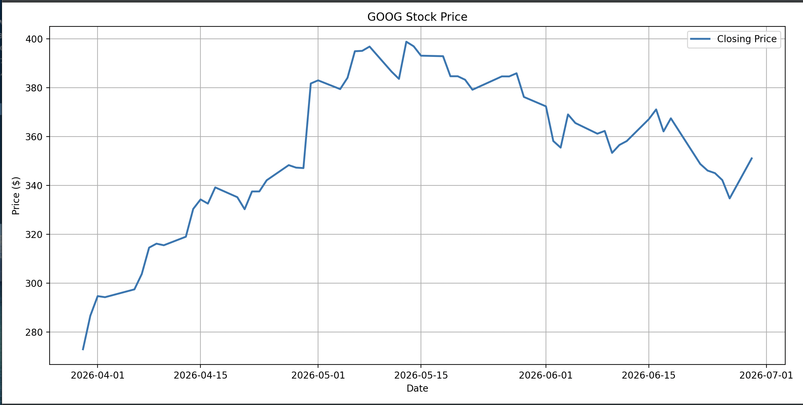

# Stock Market Analyzer

## Overview

The Stock Market Analyzer is a Python application that retrieves live financial market data from the Yahoo Finance API and performs exploratory stock analysis.

Users can analyze historical or intraday market performance, calculate descriptive statistics, and visualize stock price trends using Matplotlib. The project demonstrates API integration, data analysis, and data visualization using Python.

---

## Features

- Retrieve live stock market data using the Yahoo Finance API
- Analyze historical performance using custom date ranges
- Analyze recent intraday market activity
- Calculate descriptive statistics
- Visualize historical stock prices with Matplotlib
- Display a 20-period moving average
- Export historical market data to CSV

---

## Technologies

- Python
- Pandas
- Matplotlib
- yfinance
- Jupyter Notebook

---

## Installation

### Option 1: Download the Repository

1. Click **Code** → **Download ZIP** on GitHub.
2. Extract the ZIP file.
3. Open the project folder.

### Option 2: Clone the Repository

```bash
git clone https://github.com/yourusername/Stock-Market-Analyzer.git
```

### Install the Required Packages

```bash
pip install -r requirements.txt
```

### Run the Jupyter Notebook

Launch Jupyter Notebook:

```bash
jupyter notebook
```

Open **Stock Market Analyzer.ipynb** and select **Run → Run All Cells**.

The notebook is self-contained and downloads live market data automatically. No code modifications are required.

---

## Repository Structure

```text
Stock Market Analyzer/
│
├── README.md
├── StockMarketAnalyzer.py
├── Stock Market Analyzer.ipynb
├── requirements.txt
└── images/
```

---

## Example Workflow

1. Launch the application.
2. Select Historical Analysis or Intraday Analysis.
3. Enter a stock ticker.
4. Select a date range or intraday interval.
5. Review summary statistics.
6. Visualize historical price performance.
7. Optionally export the data to CSV.

---

## Sample Visualization



---

## Jupyter Notebook

This repository also includes a Jupyter Notebook demonstrating the analytical workflow used by the application.

The notebook is designed to run from start to finish without modification after installing the required packages. Simply open **Stock Market Analyzer.ipynb** and select **Run → Run All Cells**.

The notebook walks through:

- Downloading live stock market data
- Exploring the dataset
- Calculating summary statistics
- Visualizing historical stock performance

---

## Future Enhancements

Potential improvements for future versions include:

- Compare multiple stocks on a single chart
- Normalize stock performance for investment comparisons
- Additional moving averages
- Volatility analysis
- Technical indicators (RSI, MACD, Bollinger Bands)
- Interactive dashboard using Streamlit

---

## Author

**Brian Sentz**

Technical Project Manager | PMP | Data Analytics | Python | SQL | Tableau
